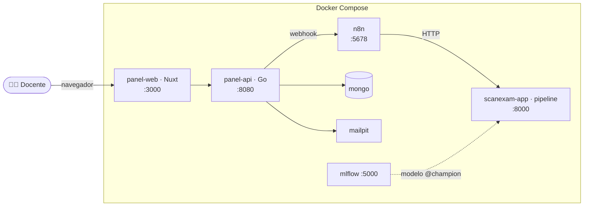

# 🎯 ScanExam AI

Sistema local de **corrección automática de fichas ópticas** (hojas de respuestas)
a partir de **fotografías**. El docente sube las fotos de los exámenes y la clave
de respuestas; el sistema identifica al estudiante, califica cada ficha con una
red neuronal y separa automáticamente los casos que requieren revisión humana.

Arquitectura **local, orientada a eventos**: un panel web para el docente, un
orquestador (**n8n**), un motor de visión + IA + reglas (**Python**), y
persistencia + notificación por email — todo contenerizado con **Docker Compose**.

---

## ¿Qué hace?

1. El docente sube las **imágenes** de las fichas y la lista de **estudiantes** y
   la **clave de respuestas** desde el panel web.
2. Cada ficha se **normaliza** (detección de marcadores + corrección de
   perspectiva), se **recorta** por coordenadas de la plantilla y sus burbujas se
   **clasifican** con una CNN (`EMPTY` / `MARKED` / `GHOST`).
3. Se **reconstruye el código del estudiante**, se aplican **reglas deterministas**
   por pregunta y se **califica** contra la clave.
4. Los resultados se **persisten**, el estudiante recibe su nota por **email** con
   una clave de acceso y puede **consultarla** en un sitio web.

Cada ficha termina en uno de tres estados:

| Estado | Significado |
| --- | --- |
| **`OK`** | Procesada, estudiante identificado y **calificada** (nota publicable). |
| **`OBSERVED`** | Procesable, pero el estudiante **no se identificó** con confianza → revisión docente. |
| **`ERROR`** | No se pudo procesar (marcadores no detectados, perspectiva extrema, etc.). |

Además, un lote con estructura o CSV inválidos se **rechaza en la recepción**
(*fail-fast*), antes de procesar nada.

---

## Arquitectura



- **Panel docente (P4)** — `scan-exam-panel/`: frontend Nuxt + backend Go (auth,
  subida, persistencia MongoDB, notificación por email, consulta con clave).
- **Orquestador (n8n)** — dispara las fases del pipeline y enruta por estado.
- **Motor del pipeline (P3)** — `app/`: recortes, CNN, identidad, reglas y
  calificación, expuesto por una API HTTP.
- **Visión (P2)** y **clasificador CNN (P1)** — módulos que el pipeline consume.
- **MLflow** — versiona el modelo (alias `@champion`); no se necesita en runtime.

**Idea clave:** la lógica de negocio (visión, CNN, reglas) vive en **Python**;
n8n **orquesta** y el panel **consume** todo por HTTP. Ver
[`docs/INTEGRACION.md`](docs/INTEGRACION.md) para el detalle.

---

## Arranque rápido

Requisitos: Docker + Docker Compose.

```bash
# 1. Construir imágenes
DOCKER_BUILDKIT=0 docker compose build

# 2. Entrenar y versionar el modelo (una vez)
docker compose up --build mlflow trainer

# 3. Levantar la plataforma
docker compose up -d scanexam-app n8n mongo mailpit panel-api panel-web

# 4. Importar el workflow de n8n (ver docs/INTEGRACION.md §7)
```

Accesos: **panel http://localhost:3000** · API pipeline http://localhost:8000/docs ·
n8n http://localhost:5678 · mailpit http://localhost:8025 · MLflow http://localhost:5000.

Para validar el camino `OK` sin una foto real, se puede generar una ficha bien
llenada con `app/utilitarios/generar_ficha_sintetica.py`.

---

## Estructura del repositorio

```text
app/                  # Motor del pipeline (P3) + módulos de P1/P2 + API HTTP
scan-exam-panel/      # Panel docente (P4): backend Go + frontend Nuxt
n8n_workflows/        # Workflow de orquestación de n8n
data/plantilla/       # Plantilla oficial de la ficha + coordenadas
data/dataset_burbujas/# Dataset de burbujas para entrenar la CNN
models/               # Modelo entrenado (servido en runtime; .pt ignorado por Git)
docker/               # Dockerfile de la app
docs/                 # Documentación (integración, ADRs, contratos, flujo)
```

---

## Documentación

| Documento | Contenido |
| --- | --- |
| [`docs/INTEGRACION.md`](docs/INTEGRACION.md) | **Cómo está integrado todo** (servicios, flujo, contratos, despliegue). |
| [`ESTRUCTURA_PROYECTO.md`](ESTRUCTURA_PROYECTO.md) | Guía de arquitectura, carpetas y responsabilidades del equipo (P1–P5). |
| [`docs/adr/`](docs/adr/) | Decisiones de arquitectura (ADRs) con su *porqué*. |
| [`docs/informacion_relevante_entre_modulos/`](docs/informacion_relevante_entre_modulos/) | Contratos entre módulos (batch, plantilla, reglas, n8n). |
| [`docs/especificacion_flujo/`](docs/especificacion_flujo/) | Especificación del flujo de procesamiento de un lote. |

---

## Stack

Python (OpenCV, PyTorch, Flask) · Go · Nuxt/Vue · n8n · MongoDB · MLflow ·
mailpit · Docker Compose.
