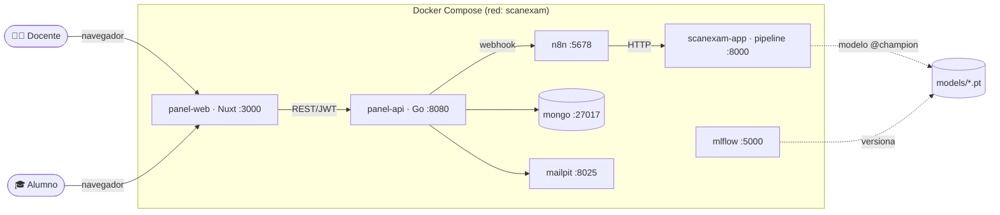

# 🏛️ Arquitectura y Componentes — ScanExam AI

> **Este es el punto de entrada para entender TODO el proyecto.** Cataloga cada
> componente de corrido y sirve de índice al resto de la documentación. Para el
> *cómo se conecta el flujo* ver [`INTEGRACION.md`](INTEGRACION.md); para el
> *porqué* de cada decisión, los [ADRs](adr/).

---

## 1. Qué es ScanExam

Sistema **local** para **corregir automáticamente fichas ópticas** (hojas de
respuestas) a partir de **fotografías**. El docente sube las fotos y la clave; el
sistema identifica al estudiante, califica con una CNN + reglas deterministas,
persiste resultados, notifica al alumno por email y le permite consultar su nota.
Arquitectura **orientada a eventos**, contenerizada con **Docker Compose**.

**Principio rector:** la lógica de negocio (visión, CNN, reglas) vive en
**Python**; **n8n orquesta** el pipeline; el **panel** (Go + Nuxt) es la cara al
usuario y consume el pipeline por HTTP. Ningún componente invade al otro.



---

## 2. Catálogo de componentes (servicios Docker)

Los 8 servicios de [`docker-compose.yml`](../docker-compose.yml). Comparten red;
se resuelven por nombre de servicio (p. ej. `http://scanexam-app:8000`).

| # | Servicio | Tecnología | Puerto | Responsabilidad | Entradas → Salidas |
| - | --- | --- | --- | --- | --- |
| 1 | **panel-web** | Nuxt / Vue 3 / TS | 3000 | UI del docente (login, carga) y consulta pública del alumno | navegador → REST a panel-api |
| 2 | **panel-api** | Go (hexagonal) | 8080 | Auth JWT, recibe el examen, dispara el pipeline, persiste y notifica | multipart / JSON → n8n + Mongo + mailpit |
| 3 | **n8n** | n8n | 5678 | Orquesta las fases del pipeline y enruta por estado de ficha | webhook `{batch_id, source}` → HTTP a scanexam-app |
| 4 | **scanexam-app** | Python / Flask | 8000 | **Pipeline (P3):** visión, crops, CNN, reglas, calificación | `source/` → `resultados.json` |
| 5 | **mongo** | MongoDB 7 | 27017 | Persistencia: usuarios, lotes y resultados | documentos BSON |
| 6 | **mailpit** | mailpit | 8025 (UI) / 1025 (SMTP) | Captura de correos de notificación (entorno local) | SMTP → bandeja web |
| 7 | **mlflow** | MLflow | 5000 | Tracking de experimentos + Model Registry del clasificador | runs, métricas, modelo `@champion` |
| 8 | **trainer** | Python | — | Job de un solo uso: entrena el clasificador y lo registra | dataset → `.pt` + registro MLflow |
| + | **mongo-express** | mongo-express | 8081 | UI web opcional para inspeccionar MongoDB (dev/demo) | navegador → mongo |

`scanexam-app`, `mlflow` y `trainer` comparten una imagen ([`docker/app.Dockerfile`](../docker/app.Dockerfile)).
`panel-api` y `panel-web` tienen su propia imagen (Go, Nuxt), bajo `scan-exam-panel/`.

---

## 3. El pipeline de IA (P3, y lo que consume de P1/P2)

`scanexam-app` corre `app/api.py` (API HTTP) que delega en el motor por fases.

### 3.1 Motor de integración (P3)

| Archivo | Rol |
| --- | --- |
| `app/core_pipeline.py` | Orquestador por fases (map→reduce) + CLI: `build-batch`, `run-vision`, `crops-classify`, `score`. |
| `app/crops.py` | Recorte de burbujas por coordenadas de plantilla (64px). |
| `app/classify.py` | Adaptador que corre la CNN (P1) sobre los crops. |
| `app/identity.py` | Reconstruye el código del estudiante y lo busca en el CSV. |
| `app/scoring_engine.py` | Motor de reglas determinista (fuente de verdad de la nota). |
| `app/api.py` | Capa HTTP (Flask) que expone las fases; incluye `/docs` (Swagger). |

### 3.2 Módulos consumidos (no se modifican)

| Archivo | Dueño | Aporta |
| --- | --- | --- |
| `app/core_vision.py` | **P2** | Canonización/warp de la foto + `vision_manifest.json`. |
| `app/core_classifier.py` | **P1** | CNN `classify_bubble` (EMPTY / MARKED / GHOST). |
| `app/template_loader.py` | **P1** | Carga de la plantilla y sus coordenadas. |
| `app/dataset_builder/` | **P1** | `crear_dataset.py` (dataset) + `build_variant.py` (variantes para MLflow). |
| `app/train_classifier.py` | P3 (glue) | Entrena el modelo de P1 reproducible + MLflow. |

**Estados por ficha:** `OK` (identificada y calificada), `OBSERVED` (no
identificada → revisión), `ERROR` (no procesable). Reglas detalladas en
[`03_response_interpretation_rules.md`](informacion_relevante_entre_modulos/03_response_interpretation_rules.md).

---

## 4. El panel docente (P4) — `scan-exam-panel/`

### 4.1 Backend `panel-api` (Go, arquitectura hexagonal)

Capas por dominio: `domain` (entidades/reglas) · `application` (casos de uso) ·
`transport/http` (handlers) · `infra` (mongodb, n8n, storage, smtp).

Dominios y endpoints:

| Módulo | Endpoint | Función |
| --- | --- | --- |
| `auth` | `POST /auth/login` | Login del docente → **JWT**. |
| `exam` | `POST /exams/upload` (JWT) | Recibe el examen (multipart), escribe el lote, dispara n8n, persiste, notifica. |
| `exam` | `POST /results/lookup` | Consulta pública del alumno (id + clave de acceso). |
| `user` | `/users/...` (JWT) | Gestión de usuarios. Al arrancar crea `admin` (`ADMIN_PASSWORD`). |

Consume el pipeline por el **webhook de n8n** (`internal/exam/infra/n8n/client.go`)
con el contrato `{batch_id, source}`; ver [ADR-0004](adr/0004-cli-por-fases-y-orquestacion-n8n.md).

### 4.2 Frontend `panel-web` (Nuxt / Vue)

Login (JWT), formulario de carga (imágenes + **tablas editables** de estudiantes
y respuestas → CSV), y **página pública de consulta** (`/consulta/[id]`).
**Recibe multipart, no ZIP** — ver nota en
[`especificacion_flujo/00_...`](especificacion_flujo/00_procesamiento_lote_zip.md).

---

## 5. Modelo de IA y versionado (MLflow)

- **Clasificador (P1):** CNN de 3 clases (`EMPTY`/`MARKED`/`GHOST`), 3 conv + 2 fc,
  entrada 64×64 en escala de grises. Definida en `app/core_classifier.py`.
- **Entrenamiento reproducible:** `app/train_classifier.py` (semilla fija) registra
  en MLflow params, métricas, matriz de confusión y el modelo, con alias
  **`@champion`** ([ADR-0003](adr/0003-versionado-del-modelo-con-mlflow.md)).
- **Runtime desacoplado:** el pipeline carga el `.pt` desde
  `models/bubble_classifier_v1.pt` — **MLflow no necesita estar encendido para
  operar**, solo para entrenar/auditar.
- **Curación de datos:** el dataset se arma de fichas maestras f1–f12; el champion
  usa f1–f9 (ver el demo de 3 experimentos en [`DEMO.md`](DEMO.md)).

---

## 6. Modelo de datos (MongoDB)

El panel (`panel-api`) usa dos bases: **`exams`** (colecciones `batches` y
`results`) y **`users`** (colección `users`). Se pueden inspeccionar en el
navegador con **mongo-express** (http://localhost:8081).

### `users`
| Campo | Tipo | Nota |
| --- | --- | --- |
| `_id`, `username`, `email` | string | |
| `password` | string | hash **bcrypt** |

### `batches`
| Campo | Tipo | Nota |
| --- | --- | --- |
| `_id`, `batch_id`, `name` | string | |
| `summary` | objeto | conteos por estado (OK/OBSERVED/ERROR) |
| `created_at` | int64 | timestamp |

### `results` (una por ficha)
| Campo | Tipo | Nota |
| --- | --- | --- |
| `_id`, `batch_ref` | string | referencia al lote |
| `access_key` | string | clave que el alumno usa para consultar |
| `file`, `processing_status`, `quality_status`, `publishable` | | |
| `student_code` `{value, confidence}`, `student_name`, `email` | | |
| `score`, `max_score`, `percentage`, `issue_code`, `processing_message` | | |
| `answers[]` | array | `{question_id, detected_answer, accepted_answer, correct_answer, question_status, points, earned_points, confidence}` |
| `created_at` | int64 | |

> Estos campos reflejan el contrato `resultados.json` del pipeline
> ([sec. 9 de response_interpretation_rules](informacion_relevante_entre_modulos/03_response_interpretation_rules.md))
> enriquecido con `access_key` y `batch_ref` por el panel.

---

## 7. Flujo end-to-end (resumen)

```
Docente → panel-web → panel-api: valida, escribe uploads/BATCH-X, dispara n8n
  → n8n: build-batch → run-vision(P2) → crops-classify(P1+CNN) → score(P3)
       → Switch por ficha OK/OBSERVED/ERROR → resultados.json
  → panel-api: persiste en Mongo + email (mailpit) con clave de acceso
Alumno → panel-web /consulta/[id] + clave → ve su nota
```

Detalle paso a paso y diagrama de secuencia en [`INTEGRACION.md §4`](INTEGRACION.md).

---

## 8. Stack tecnológico

| Capa | Tecnología |
| --- | --- |
| Frontend | Nuxt 3 / Vue / TypeScript / Nuxt UI |
| Backend panel | Go (arquitectura hexagonal, chi, JWT, bcrypt) |
| Pipeline / IA | Python · OpenCV · PyTorch · Flask |
| Orquestación | n8n |
| Persistencia | MongoDB 7 |
| Email (dev) | mailpit |
| MLOps | MLflow |
| Contenerización | Docker Compose |

---

## 9. Responsabilidades del equipo (P1–P5)

| | Responsable de | Entregables clave |
| --- | --- | --- |
| **P1** | Plantilla, contratos, dataset y **CNN** | `core_classifier.py`, plantilla + coordenadas, dataset f1–f12 |
| **P2** | **Visión** (marcadores, warp, calidad) | `core_vision.py`, `vision_manifest.json` |
| **P3** | **Integración**: pipeline, API, n8n, Docker, MLflow | `core_pipeline.py`, `api.py`, workflow n8n, compose |
| **P4** | **Panel docente** (real: Go + Nuxt + Mongo) | `scan-exam-panel/` |
| **P5** | Documentación, evidencia y exposición | informes, diagramas, casos de prueba |

> Nota histórica: `panel_docente/` (Flask) fue un **stub** de P3 para probar el
> contrato; quedó superado por `scan-exam-panel/` (P4). Ver
> [ADR-0005](adr/0005-panel-docente-stub-minimo.md).

---

## 10. Mapa de documentación (qué leer para qué)

| Necesito… | Documento |
| --- | --- |
| Visión rápida del proyecto | [`README.md`](../README.md) |
| **Entender todos los componentes (este doc)** | `docs/ARQUITECTURA.md` |
| Cómo se integra y conecta el flujo | [`docs/INTEGRACION.md`](INTEGRACION.md) |
| Levantar y demostrar por terminal | [`docs/DEMO.md`](DEMO.md) |
| El *porqué* de cada decisión | [`docs/adr/`](adr/) (0001–0010) |
| Contratos entre módulos | [`docs/informacion_relevante_entre_modulos/`](informacion_relevante_entre_modulos/) |
| Reglas de calificación e interpretación | [`03_response_interpretation_rules.md`](informacion_relevante_entre_modulos/03_response_interpretation_rules.md) |
| Flujo de procesamiento del lote | [`docs/especificacion_flujo/`](especificacion_flujo/) |
| Estructura de carpetas y equipo | [`ESTRUCTURA_PROYECTO.md`](../ESTRUCTURA_PROYECTO.md) |
| Especificación base (histórica) | [`ScanExam_linea_base_v7.md`](../ScanExam_linea_base_v7.md) |

---

## 11. Cómo levantar todo

Ver el runbook completo por terminal en [`docs/DEMO.md`](DEMO.md). Resumen:

```bash
sudo systemctl start docker
DOCKER_BUILDKIT=0 docker compose build
docker compose up -d mlflow trainer                       # entrena el champion
docker compose up -d scanexam-app n8n mongo mailpit panel-api panel-web mongo-express
# importar workflow n8n (ver DEMO.md) y abrir http://localhost:3000
```
