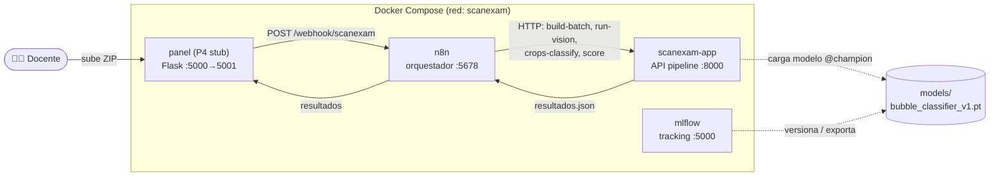
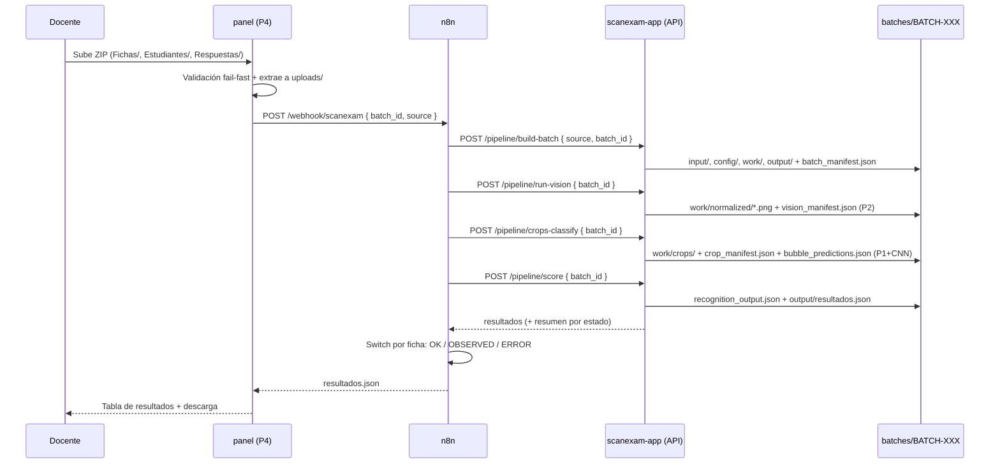

# 🔗 Documentación de Integración — ScanExam AI

Este documento describe **cómo está integrado todo el sistema**: los servicios,
los componentes de software, el flujo de datos de punta a punta, los contratos
entre módulos y cómo levantar y operar la plataforma.

Es la vista de integración (responsabilidad **P3**). Para el detalle interno de
cada módulo, ver `ESTRUCTURA_PROYECTO.md` y los contratos en
`docs/informacion_relevante_entre_modulos/`. Para el *porqué* de cada decisión,
ver los [ADRs](adr/).

---

## 1. Visión general

ScanExam corrige automáticamente fichas ópticas fotografiadas. La integración
conecta cinco piezas en un flujo orientado a eventos, orquestado por **n8n** y
contenerizado con **Docker Compose**:



**Idea clave de la integración:** el pipeline es un **motor Python** que expone
sus fases por **HTTP**. n8n **orquesta** (llama las fases y enruta por estado);
el panel P4 **reutiliza la misma API**. La lógica de negocio (visión, CNN,
reglas) vive en Python, no en n8n ([ADR-0001](adr/0001-motor-de-reglas-en-python.md),
[ADR-0004](adr/0004-cli-por-fases-y-orquestacion-n8n.md)).

---

## 2. Servicios (Docker Compose)

Definidos en [`docker-compose.yml`](../docker-compose.yml). Todos comparten la
red por defecto del proyecto (`scanexam`), por lo que se resuelven por nombre de
servicio (p. ej. `http://scanexam-app:8000`).

| Servicio | Imagen | Puerto host | Rol |
| --- | --- | --- | --- |
| `scanexam-app` | `scanexam-app:latest` | **8000** | API HTTP del pipeline (P3). Larga vida. |
| `n8n` | `n8nio/n8n:latest` | **5678** | Orquestador del pipeline. |
| `panel` | `scanexam-app:latest` | **5001** → 5000 | Stub del panel docente (P4). |
| `mlflow` | `scanexam-app:latest` | **5000** | Tracking + Model Registry del clasificador. |
| `trainer` | `scanexam-app:latest` | — | Job de un solo uso: entrena y registra el modelo. |

Una sola imagen (`scanexam-app`, construida desde [`docker/app.Dockerfile`](../docker/app.Dockerfile))
sirve para la API, el panel, MLflow y el entrenamiento. El repo se monta como
volumen (`./:/workspace`) para que todos los servicios vean `batches/`,
`models/`, `data/` y el código.

---

## 3. Componentes de software

### 3.1 Motor del pipeline (P3 — lo que integra)

| Archivo | Responsabilidad |
| --- | --- |
| `app/core_pipeline.py` | Orquestador por fases (map→reduce) + CLI. |
| `app/crops.py` | Recorte de burbujas por coordenadas de plantilla (64px). |
| `app/classify.py` | Adaptador que corre la CNN (P1) sobre los crops. |
| `app/identity.py` | Reconstrucción del código de estudiante + búsqueda en CSV. |
| `app/scoring_engine.py` | Motor de reglas determinista (fuente de verdad). |
| `app/api.py` | Capa HTTP (Flask) que expone las fases; incluye `/docs`. |

### 3.2 Módulos que se consumen (no se modifican)

| Archivo | Dueño | Se usa para |
| --- | --- | --- |
| `app/core_vision.py` | **P2** | Canonización/warp + `vision_manifest.json`. Se invoca vía la fase `run-vision`. |
| `app/core_classifier.py` | **P1** | CNN `classify_bubble` / `classify_crops`. |
| `app/template_loader.py` | **P1** | Carga de la plantilla y sus coordenadas. |
| `app/train_classifier.py` | P3 (glue) | Entrena el modelo de P1 de forma reproducible + MLflow. |

### 3.3 Orquestación y UI

| Archivo | Rol |
| --- | --- |
| `n8n_workflows/scanexam_flujo_principal.json` | Workflow de n8n (webhook → fases → routing). |
| `panel_docente/main.py` | Stub del panel docente (P4). |

---

## 4. Flujo de datos end-to-end



**Regla de oro de estados** (aplicada en `score`): una ficha es `OK` solo si es
visualmente procesable **y** el estudiante se identifica; si no,
`OBSERVED`/`ERROR` sin nota publicable. La calificación es determinista
(mismas predicciones → mismo resultado).

---

## 5. Contrato de estructura del BATCH

Cada lote vive en `batches/<BATCH_ID>/` (carpeta ignorada por Git). La generan
las fases del pipeline según [`01_batch_contract.md`](informacion_relevante_entre_modulos/01_batch_contract.md):

```text
batches/BATCH-XXX/
├── input/                      # fichas originales (P3 build-batch)
├── config/                     # estudiantes_matriculados.csv, claves.csv
├── work/
│   ├── normalized/*.png        # canónicas 2100x1480 (P2 run-vision)
│   ├── vision_manifest.json    # estado visual por ficha (P2)
│   ├── crops/*.png             # 130 recortes por ficha (P3 crops)
│   ├── crop_manifest.json      # (P3)
│   ├── bubble_predictions.json # clases EMPTY/MARKED/GHOST (P1 CNN)
│   └── recognition_output.json # interpretación por pregunta (P3)
├── output/
│   └── resultados.json         # salida final consolidada (P3 score)
└── batch_manifest.json
```

Artefactos JSON intermedios = **contratos** entre fases. Cada fase lee los de la
anterior y escribe el suyo, lo que las hace depurables y reejecutables por
separado.

---

## 6. La API HTTP del pipeline

Servida por `scanexam-app` ([`app/api.py`](../app/api.py)). Documentación
interactiva (Swagger UI) en **http://localhost:8000/docs**; spec en `/openapi.json`.

| Método | Ruta | Cuerpo | Efecto |
| --- | --- | --- | --- |
| `GET` | `/health` | — | Liveness. |
| `POST` | `/pipeline/build-batch` | `{ source, batch_id }` | Crea la estructura del BATCH. |
| `POST` | `/pipeline/run-vision` | `{ batch_id }` | P2: canoniza → `vision_manifest.json`. |
| `POST` | `/pipeline/crops-classify` | `{ batch_id }` | Recorta + CNN → `bubble_predictions.json`. |
| `POST` | `/pipeline/score` | `{ batch_id }` | Reglas + calificación → `resultados.json`. |
| `POST` | `/pipeline/run-all` | `{ source, batch_id }` | Las 4 fases en secuencia (demo). |

La API es **solo transporte**: cada endpoint delega en `core_pipeline`. No
contiene lógica de negocio.

---

## 7. El workflow de n8n

Archivo: [`n8n_workflows/scanexam_flujo_principal.json`](../n8n_workflows/scanexam_flujo_principal.json)
(id `scanexamMain0001`, webhook `POST /webhook/scanexam`).

```text
[Webhook] → [build-batch] → [run-vision] → [crops-classify] → [score] ┬→ [Responder resultados]
                                                                       └→ [Separar fichas] → [Switch por estado]
                                                                                              ├ OK       → Publicar
                                                                                              ├ OBSERVED → Revisión docente
                                                                                              └ ERROR    → Incidencia técnica
```

- Los 4 nodos de fase son **HTTP Request** contra `http://scanexam-app:8000`.
- El nodo **Switch** enruta cada ficha por `processing_status`: es la
  **decisión inteligente del orquestador** (n8n decide el camino; Python decide
  el contenido).
- `Responder resultados` devuelve el `resultados.json` completo al llamador.

**Importar/actualizar el workflow** (tras editar el JSON):

```bash
docker exec scanexam-n8n n8n import:workflow --input=/workspace/n8n_workflows/scanexam_flujo_principal.json
docker exec scanexam-n8n n8n publish:workflow --id=scanexamMain0001
docker restart scanexam-n8n   # necesario para registrar el webhook
```

---

## 8. El panel docente (P4 — stub)

[`panel_docente/main.py`](../panel_docente/main.py) en **http://localhost:5001**.
Cierra el ciclo: subir ZIP → **validación fail-fast** → disparar el webhook de
n8n → mostrar/descargar resultados. Es un **esqueleto** con marcadores `TODO(P4)`
donde la responsable de P4 construye lo real (validación de CSV completa,
reportes `.xlsx`, pantalla de progreso, sitio de consulta, estilos). No calcula
nada: habla con el pipeline por HTTP.

---

## 9. Versionado del modelo (MLflow)

El clasificador de P1 se entrena de forma reproducible con
[`app/train_classifier.py`](../app/train_classifier.py) (semilla fija) y se
registra en MLflow como `bubble_classifier` con alias **`@champion`**
([ADR-0003](adr/0003-versionado-del-modelo-con-mlflow.md)). El `.pt` se exporta a
`models/bubble_classifier_v1.pt`, que es lo que la CNN carga en runtime. MLflow
UI en **http://localhost:5000**.

```bash
docker compose up --build mlflow trainer   # entrena y registra @champion
```

---

## 10. Cómo levantar todo

Requisitos: Docker + Docker Compose. En este entorno el daemon se arranca con
`sudo systemctl start docker` y el build usa el builder legacy
([ADR-0006](adr/0006-contenerizacion-y-entorno.md)).

```bash
# 1. Construir la imagen de la app (una vez)
DOCKER_BUILDKIT=0 docker compose build scanexam-app

# 2. (Si aún no hay modelo) entrenar y versionar
docker compose up --build mlflow trainer

# 3. Levantar la plataforma
docker compose up -d scanexam-app n8n panel

# 4. Importar/activar el workflow de n8n (ver §7)
```

Servicios: panel http://localhost:5001 · API http://localhost:8000/docs ·
n8n http://localhost:5678 · MLflow http://localhost:5000.

---

## 11. Cómo correr un lote (3 formas)

**A) Desde el panel (flujo del docente):** subir el ZIP en http://localhost:5001.

**B) Disparando el webhook de n8n directamente:**

```bash
curl -X POST http://localhost:5678/webhook/scanexam \
  -H "Content-Type: application/json" \
  -d '{"batch_id":"BATCH-001","source":"data/lotes_prueba/real"}'
```

**C) Contra la API, sin n8n (útil para depurar):**

```bash
curl -X POST http://localhost:8000/pipeline/run-all \
  -H "Content-Type: application/json" \
  -d '{"batch_id":"BATCH-001","source":"data/lotes_prueba/real"}'
```

**D) Por CLI dentro del contenedor (fase por fase):**

```bash
docker exec scanexam-app python -m app.core_pipeline build-batch --source data/lotes_prueba/real --batch-id BATCH-001
docker exec scanexam-app python -m app.core_pipeline run-vision     --batch BATCH-001
docker exec scanexam-app python -m app.core_pipeline crops-classify --batch BATCH-001
docker exec scanexam-app python -m app.core_pipeline score          --batch BATCH-001
```

Los resultados quedan en `batches/BATCH-001/output/resultados.json`.

---

## 12. Pruebas

Los tests corren dentro de la imagen (trae torch/cv2/flask):

```bash
docker run --rm -v "$(pwd)":/workspace -w /workspace \
  -e PYTHONPATH=/workspace:/workspace/app scanexam-app:latest \
  python -m pytest app/ panel_docente/ -q
```

Cobertura de integración: `test_core_pipeline` (fases + end-to-end de scoring),
`test_api` (contrato HTTP + `/docs`), `test_panel` (validación fail-fast),
además de los tests por módulo (crops, classify, identity, scoring, vision).

---

## 13. Decisiones de arquitectura (ADRs)

| ADR | Decisión |
| --- | --- |
| [0001](adr/0001-motor-de-reglas-en-python.md) | Motor de reglas en Python, no en n8n. |
| [0002](adr/0002-paralelismo-en-python.md) | Paralelismo en Python (ProcessPool + CNN). |
| [0003](adr/0003-versionado-del-modelo-con-mlflow.md) | Versionado del modelo con MLflow `@champion`. |
| [0004](adr/0004-cli-por-fases-y-orquestacion-n8n.md) | CLI por fases + n8n orquesta por **HTTP**. |
| [0005](adr/0005-panel-docente-stub-minimo.md) | Panel docente como stub mínimo. |
| [0006](adr/0006-contenerizacion-y-entorno.md) | Contenerización y entorno. |
| [0007](adr/0007-confidence-por-pregunta.md) | Cálculo del `confidence` por pregunta. |
| [0008](adr/0008-reconstruccion-codigo-estudiante.md) | Reconstrucción del código de estudiante. |

---

## 14. Estado y pendientes

**Integrado y verificado end-to-end:** panel → n8n → API → pipeline (P2+P1+P3) →
`resultados.json` → panel, con routing por estado y modelo versionado.

**Pendiente (fuera del núcleo de integración):**
- Reportes `.xlsx` e imágenes anotadas (P4 + evidencia P5).
- Validación completa de contenido de CSV en el panel (`TODO(P4)`).
- Optimizar la imagen a wheels de torch CPU (hoy ~6 GB por el wheel CUDA).
- Corrida de validación con una ficha `OK` bien llenada (datos de prueba P5).

---

## 15. Notas de entorno / troubleshooting

- **Daemon Docker:** `sudo systemctl start docker` (no arranca solo).
- **buildx ausente:** usar `DOCKER_BUILDKIT=0 docker compose build`.
- **`PYTHONPATH=/workspace:/workspace/app`**: necesario porque `core_classifier.py`
  hace `import config`; se inyecta por entorno, sin tocar el archivo de P1.
- **MLflow y pandas:** MLflow exige `pandas<3`; la imagen usa pandas 2.x + mlflow 3.14.
- **Webhook n8n no responde:** reiniciar el contenedor tras `publish:workflow`.
