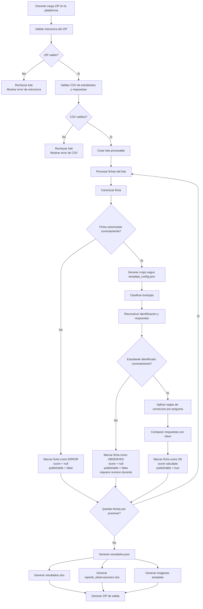

## Responsables de implementación:

- Validación de estructura de ZIP y CSV -> **P4**
- Canonización y calidad visual -> **P2**
- Identificación, clasificación y estados `OK/OBSERVED/ERROR` -> **P3**

> **Nota (actualización de integración):** el **panel docente de producción**
> (`scan-exam-panel/`) ya **no recibe un ZIP**. El docente sube las **imágenes**
> de las fichas y edita **estudiantes** y **respuestas** en tablas del navegador
> (petición `multipart/form-data`); `panel-api` reconstruye internamente la
> estructura `Fichas/ Estudiantes/ Respuestas/` descrita abajo. Por eso este
> documento sigue vigente como **contrato de la estructura interna del lote** (lo
> que consume el pipeline), aunque el ZIP ya no sea la puerta de entrada real.
> Detalle en [`../INTEGRACION.md`](../INTEGRACION.md) §5 y §8.

## Requisitos previos:
Definición de la estructura del zip de entrada:

```text
E_Parcial_Seccion_A.zip
├── Fichas/
│   ├── ficha_001.jpg
│   ├── ficha_002.png
│   ├── ...
│   └── ficha_030.jpeg
├── Estudiantes/
│   └── estudiantes_matriculados.csv (\*)
└── Respuestas/
    └── claves_parcial_2026_01.csv 
```

(\*) Tanto las carpetas "Estudiantes" como "Respuestas" aceptan cualquier nombre de archivo, lo unico que se espera se valide es que solo haya un archivo en cada directorio respectivamente. Esta consideración es clave para **P4**

## Criterios de lectura del flujo

El flujo distingue entre errores globales del lote y errores individuales por ficha.

Los errores globales ocurren durante la validación inicial del ZIP o de los CSV. En estos casos el lote se rechaza y no se procesa ninguna ficha.

Los errores individuales ocurren después de crear un lote procesable. En estos casos el lote continúa, pero cada ficha puede terminar con uno de tres estados:

- `OK`: la ficha fue procesada, identificada y calificada correctamente.
- `OBSERVED`: la ficha es procesable, pero el estudiante no pudo ser identificado con suficiente confianza.
- `ERROR`: la ficha no pudo procesarse correctamente por un problema visual, técnico o de plantilla.

## Diagrama de Flujo



## Relación del diagrama con los anexos

| Parte del flujo | Resultado posible | Referencia |
|---|---|---|
| Validar estructura del ZIP | Rechazo del lote | [Requisitos previos](#requisitos-previos) |
| Validar CSV de estudiantes y respuestas | Rechazo del lote | [Requisitos previos](#requisitos-previos) |
| Canonizar ficha | `ERROR` por ficha | [Anexo A](#anexo-a) |
| Evaluar `LOW_CONFIDENCE` | `ERROR` por ficha | [Anexo C](#anexo-c) |
| Estudiante identificado correctamente | `OK` u `OBSERVED` | [Anexo D](#anexo-d)|
| Generar reportes | Resultados y observaciones | [Anexo B](#anexo-b)|

---

### Anexo A

Errores posibles:

#### `MARKERS_NOT_FOUND`

No se encontraron correctamente los 4 marcadores de referencia.

Puede ocurrir si:

- la foto corta parte de la hoja;
- un marcador está tapado;
- hay sombras fuertes;
- el fondo se confunde con los marcadores;
- el marcador especial no puede distinguirse.

Acción esperada:

- marcar el procesamiento como fallido;
- pedir al usuario que tome una nueva foto mostrando toda la hoja.

#### `INVALID_ORIENTATION` 

Los marcadores fueron detectados, pero la orientación no coincide con la plantilla esperada.

Puede ocurrir si:

- la hoja está rotada incorrectamente;
- el marcador especial no queda en `top_right`;
- la imagen final queda vertical en lugar de horizontal (landscape);
- los puntos fueron ordenados de forma incorrecta.

Acción esperada:

- marcar el procesamiento como fallido;
- pedir una nueva foto respetando la orientación de la ficha.


#### `LOW_CONFIDENCE`

La detección parece posible, pero no suficientemente confiable.

Puede ocurrir si:

- la foto está borrosa;
- hay demasiada sombra o brillo excesivo;
- los marcadores no se encuentran en las posiciones esperadas;

Acción esperada:

- marcar el procesamiento como fallido;
- pedir una foto más clara, mejor iluminada y menos inclinada.

Para entender como implementar las metricas de `LOW_CONFIDENCE` referirse a [Anexo C](#anexo-c)

#### `WARP_FAILED`

Falló la transformación de perspectiva hacia la imagen canónica.

Puede ocurrir si:

- no se pudo calcular correctamente la homografía;
- los puntos detectados están mal ordenados;
- la salida queda deformada, cortada o con zonas negras;
- la imagen resultante no cumple el tamaño esperado `2100 × 1480 px`.

Acción esperada:

- marcar el procesamiento como fallido;
- pedir una nueva foto.

---

### Anexo B
##### Salida cuando existen fichas con `ERROR` u `OBSERVED`

Cuando una o más fichas no pueden procesarse correctamente, el lote no se aborta. El sistema genera los resultados del lote y registra los casos problemáticos en archivos de revisión.

```text
resultados_lote.zip
├── resultados.json
├── resultados.xlsx
├── reporte_observaciones_y_errores.xlsx
├── imagenes_anotadas/
├── fichas_con_observaciones/
│   ├── ficha_03.jpg
│   └── ficha_027.png
└── fichas_con_error/
    └── ficha_014.png
```

---

### Anexo C
##### Métricas objetivas para `LOW_CONFIDENCE`

El error `LOW_CONFIDENCE` se activa cuando la ficha logra ser detectada o canonizada, pero no supera controles mínimos de calidad necesarios para garantizar una lectura confiable. Para evitar que “baja calidad” sea un criterio subjetivo, se propone evaluarla mediante métricas objetivas aplicadas principalmente sobre la ficha canonizada.

**M1. Nitidez de la imagen**

Evalúa si la ficha está demasiado borrosa para leer burbujas o marcadores con seguridad. Puede calcularse usando la varianza del Laplaciano sobre la imagen en escala de grises. Una varianza baja indica poca presencia de bordes definidos, lo que suele asociarse con desenfoque o movimiento durante la captura.

**Insumos:** imagen canonizada en escala de grises, operador Laplaciano y umbral mínimo de nitidez definido empíricamente.

**M2. Brillo e iluminación general**

Evalúa si la imagen está demasiado oscura, con sombra excesiva o demasiado brillante. Puede calcularse con el promedio de intensidad de píxeles en escala de grises. Si el promedio queda por debajo del umbral mínimo o por encima del umbral máximo, la ficha se considera poco confiable.

**Insumos:** imagen canonizada en escala de grises, promedio de intensidad y umbrales empíricos construidos a partir de fotos de prueba aceptables, oscuras y sobreexpuestas.

**M3. Zonas negras o vacías post-canonización**

Evalúa si la transformación de perspectiva generó áreas negras, vacías o deformadas en la ficha canonizada. Puede calcularse midiendo el porcentaje de píxeles muy oscuros dentro de la imagen final o dentro de bordes/zonas críticas. Un porcentaje alto puede indicar que el warp fue inestable, que la hoja fue recortada incorrectamente o que parte de la imagen quedó fuera del área útil.

**Insumos:** imagen canonizada, máscara de píxeles oscuros, porcentaje de área negra y umbral máximo permitido.

**M4. Verificación de marcadores en posiciones esperadas**

Evalúa si, después de la canonización, los marcadores de referencia aparecen en las zonas donde deberían estar según la plantilla oficial. Esta métrica es la más importante porque confirma que la imagen final conserva la orientación, escala y estructura esperadas. No es necesario buscar los marcadores en toda la imagen; basta con revisar regiones de interés cercanas a las esquinas o posiciones fijas definidas por la plantilla.

Si los marcadores no aparecen, aparecen deformados o no coinciden con la posición esperada, la ficha no debe pasar a lectura de burbujas, ya que los recortes podrían apuntar a zonas incorrectas.

**Insumos:** plantilla canónica, coordenadas esperadas de marcadores, regiones de interés, detección de contornos o comparación simple de patrones.

En conjunto, estas métricas permiten que `LOW_CONFIDENCE` sea un error técnico verificable. Los umbrales exactos no necesitan definirse teóricamente desde el inicio; pueden calibrarse con un conjunto pequeño de fotos reales tomadas en condiciones buenas, borrosas, oscuras, sobreexpuestas y mal canonizadas.

### Anexo D
#### Reglas de identificación

Una ficha queda como `OK` solo si el código del estudiante puede reconstruirse y existe en el CSV de estudiantes.

Una ficha queda como `OBSERVED` si:
- el código no puede reconstruirse;
- el código tiene baja confianza;
- el código no existe en el CSV;
- el código aparece duplicado en el lote.

Las fichas `OBSERVED` no generan nota publicable y pasan a revisión docente.